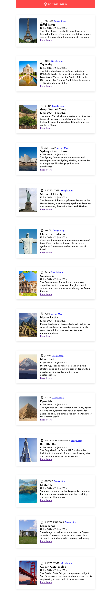

# 🗼 Travel Place - Single Page React Application

The **Travel** is a React-based Single Page React Application that users can see there faviroute place. Designed with clean UI/UX for the kids.


---

## 🖼️ Template Preview

[Play The Game Now](https://Mdyeachen.github.io/number-matching-game/)

<p align="center">
  
</p>


---

## ✨ Key Features

- 🧩 Interactive Number Box
- 📱 Responsive Design
- ⚡ Fast Performance
- 🚀 Easy Deployment
- 🎮 Progressive Difficulty
- 🔄 Replayability
- 🛠️ Developer-Friendly

---

## ⚙️ Tech Stack

- **HTML5**, **CSS3**, **bootstrap**
- **React**, **Vite**
- **JavaScript (ES6+)**
- **Responsive & Accessible Design**

---

## 📁 Folder Structure

```bash
.
├── data.json
├── eslint.config.js
├── index.html
├── package-lock.json
├── package.json
├── README.md
├── vite.config.js
├── preview
│   └── 01.png
├── public
│   ├── earth.svg
│   ├── location.svg
│   ├── react.svg
│   └── vite.svg
└── src
    ├── apps.jsx
    ├── main.css
    ├── main.jsx
    ├── assets
    │   ├── bootstrap
    │   │   ├── bootstrap.bundle.min.js
    │   │   └── bootstrap.min.css
    │   ├── fonts
    │   │   ├── JosefinSans-Light.woff
    │   │   └── JosefinSans.woff
    │   └── images
    │       ├── earth.svg
    │       ├── location.svg
    │       └── mount-fuji.jpeg
    └── Component
        ├── entry.jsx
        └── header.jsx


```

---

## 👨‍💻 Developed by Yeachen Abir

I am a passionate **Full-Stack Developer** with a strong focus on **custom website development**, **on-page SEO**, and **digital marketing** strategies. My mission is to craft web solutions that **look stunning**, **perform fast**, and **rank well** on search engines.

### 🌟 CMS Expertise:
- Shopify | BigCommerce | WordPress | Wix  
- Custom CMS with React.js & Next.js  
- eBay Store Design & Optimization  
- Walmart Marketplace Product Optimization  

### 💻 Technical Skills:
- **Frontend**: JavaScript, React.js, HTML, CSS, SCSS, Tailwind CSS, Bootstrap  
- **Backend**: Node.js, Express.js  
- **Database**: MongoDB  
- **Version Control**: Git & GitHub  

### 📈 SEO & Digital Marketing:
- Keyword Research & Meta Optimization  
- On-Page SEO & Content Enhancement  
- Technical SEO: Speed, Mobile, Schema  
- Google Analytics & Search Console  

### 🔗 Let’s Connect!
- 💼 [LinkedIn](https://www.linkedin.com/in/yeachen-abir/)  
- 📘 [Facebook Profile](https://www.facebook.com/yeachen.abir) | [Facebook Page](https://www.facebook.com/profile.php?id=61574159927866)  
- 🐦 [Twitter / X](https://x.com/YeachenA)  
- 📸 [Instagram](https://www.instagram.com/yeachenabir/)  
- 📌 [Pinterest](https://www.pinterest.com/yeachenabir/)  
- 📬 Email: [yeachenabir@gmail.com](mailto:yeachenabir@gmail.com)

---

**#yeachen #abir #webdeveloper #shopify #wordpress #ecommerce #custom_website #react_developer #next_developer #fontend_developer #full_stack_developer #numbergame #number #number #match** 

---
